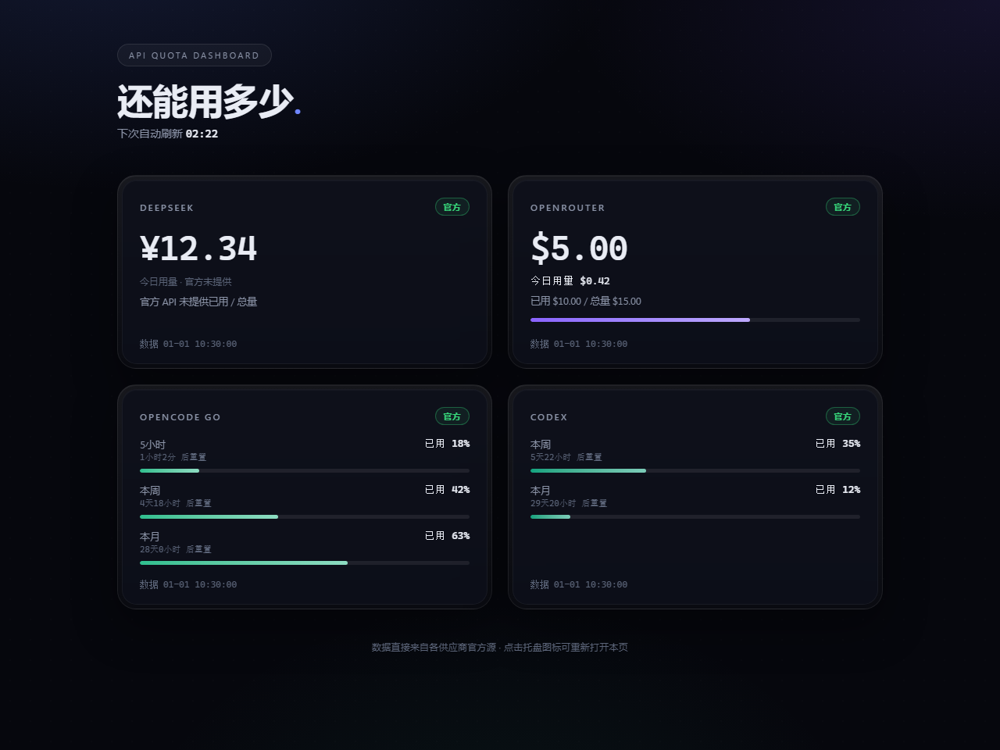

# API 配额仪表盘（API Quota Dashboard）

Windows 系统托盘常驻工具：实时显示 **DeepSeek / OpenRouter / OpenCode Go / Codex** 四家 AI API 的配额与用量余量。点击托盘图标打开浏览器仪表盘，数据全部来自各供应商**官方数据源**，不读任何本地端口 / 日志 / 代理推算。

> **所属项目 / Part of**：本组件是开源三合一项目 **`codex-auto-resume-trio`** 的「API 配额」组件，安装于仓库内 **`apps/quota-dashboard/`**。
> 同仓库另外两块分别是「Codex 自动续跑」（Node / TypeScript）与「项目总谱」（Python）。本组件**保持 Python 实现、保持独立可运行**，不与 Node 代码合并，单独拷走整个 `apps/quota-dashboard/` 目录即可运行。

A Windows tray-resident dashboard that shows the live quota and usage remaining for **DeepSeek / OpenRouter / OpenCode Go / Codex**. Click the tray icon to open the browser dashboard. All data comes from each provider's **official source** — nothing is inferred from local ports, logs, or proxies.

> **Part of**: this component is the "API quota" part of the open-source trio **`codex-auto-resume-trio`**, installed at **`apps/quota-dashboard/`**. The other two parts are "Codex auto-resume" (Node/TypeScript) and "project score" (Python). This component stays pure Python and independently runnable — copying the `apps/quota-dashboard/` directory alone is enough to run it.

---

## 功能 / Features

- 托盘常驻，后台定时刷新（默认 3 分钟，可配），单供应商失败不影响其他
- 点击托盘图标 → 打开浏览器仪表盘（本地 `127.0.0.1:8787`，仅本机可访问），页面每 15s 自动拉取，每秒倒计时
- 打开即强制刷新，保证看到最新官方数据
- 失败降级：保留最近一次官方数据并标注「刷新失败·旧数据」；从未成功过则如实显示「官方数据源不可用」
- 可选开机自启：`python install_autostart.py register`
- 无界面验证：`python main.py --selftest`
- 整个目录**不依赖任何绝对路径**，可整体移动 / 改名 / 换盘符

- Tray-resident, auto-refresh (default every 3 min, configurable); one provider failing doesn't affect the others
- Click the tray icon → browser dashboard (local `127.0.0.1:8787`, localhost only); the page pulls every 15s with a per-second countdown
- Force-refresh on open, so you always see the latest official data
- Graceful degradation: keeps the last official data marked 「刷新失败·旧数据」; if never succeeded, shows 「官方数据源不可用」
- Optional autostart: `python install_autostart.py register`
- Headless check: `python main.py --selftest`
- Zero hard-coded absolute paths — the folder can be moved / renamed / put on another drive

## 截图 / Screenshots



界面为暗色玻璃拟态四卡：DeepSeek（余额 ¥）· OpenRouter（余额 $ / 已用 / 总量 / 今日）· OpenCode Go（5小时 / 本周 / 本月 百分比 + 重置倒计时）· Codex（5小时 / 本周 / 本月 百分比 + 重置倒计时）。

A dark-glass four-card dashboard: DeepSeek (CNY balance) · OpenRouter (USD balance/used/total/today) · OpenCode Go (rolling/weekly/monthly % + reset countdown) · Codex (rolling/weekly/monthly % + reset countdown).

> 截图内为样例数据。Screenshot shows sample data.

## 安装 / Install

需要 Windows + Python 3.9+（开发于 3.11）。

```bash
# 在本仓库根目录下：
cd apps/quota-dashboard
pip install -r requirements.txt
```

Requires Windows + Python 3.9+ (developed on 3.11).

## 运行 / Run

```bash
# 1) 复制配置模板并填入自己的 key
copy config.example.yaml config.yaml
# 2) 启动托盘
python main.py
# 3) 无界面验证（跑一轮刷新打印结果后退出）
python main.py --selftest
```

开机自启：`python install_autostart.py register`。退出：托盘右键 → 退出。

Autostart: `python install_autostart.py register`. Quit: right-click the tray icon → 退出.

## 端口 / Port

浏览器仪表盘是本地 HTTP 服务（纯标准库 `http.server`），**只绑定 `127.0.0.1`，仅本机可访问**。

- **默认端口：`8787`** —— 全项目统一使用这一个默认值，刻意避开常见占用端口（47823 / 5100 / 5101 / 5173 / 3080）
- 覆盖优先级：环境变量 `API_QUOTA_PORT` > `config.yaml` 的 `dashboard_port` > 默认 `8787`
- 若 `8787` 被占用：程序**不崩溃**，自动退回系统分配的空闲端口，并打印一行中文提示说明实际端口
- 实际监听地址会在启动时打印：`[main] 本地仪表盘地址：http://127.0.0.1:8787/（托盘点击打开）`

The dashboard is a local HTTP server (stdlib `http.server`) bound to `127.0.0.1` only. **Default port: `8787`** (chosen to avoid 47823 / 5100 / 5101 / 5173 / 3080). Override order: env `API_QUOTA_PORT` > `config.yaml` `dashboard_port` > `8787`. If `8787` is taken, it falls back to an OS-assigned free port and prints the actual URL instead of crashing.

## 配置 / Configuration

所有 key 都填在 `config.yaml`（已 `.gitignore`，绝不提交）。模板见 `config.example.yaml`。

- **配置文件位置**：默认是**本项目目录下的 `config.yaml`**（基于 `__file__` 解析，与当前工作目录 / 盘符无关）。
- **放到别处**：设置环境变量 `API_QUOTA_CONFIG` 指向任意路径的配置文件，例如
  `set API_QUOTA_CONFIG=D:\secrets\quota.yaml`（PowerShell：`$env:API_QUOTA_CONFIG="D:\secrets\quota.yaml"`）。
- **缺配置时的行为**：程序打印中文提示并**直接退出（返回码 1）**，提示里带有可复制的复制命令；**绝不伪造数字、绝不用假数据顶替**。

```
[config] 未找到配置文件：...\apps\quota-dashboard\config.yaml
[config] 本项目目录：...\apps\quota-dashboard
[config] 首次运行：请复制 config.example.yaml 为 config.yaml 并填入各供应商 key。
[config]   PowerShell :  copy config.example.yaml config.yaml
[config]   cmd/bash   :  cp config.example.yaml config.yaml
[config] 也可以用环境变量 API_QUOTA_CONFIG 指向放在其它位置的配置文件。
[main] 配置不可用，已退出（未展示任何数据）。
```

If `config.yaml` is missing, the program prints a Chinese hint with the exact copy command and exits with code 1 — it never fabricates numbers. Set `API_QUOTA_CONFIG` to load a config from elsewhere.

## 各供应商配置 / Per-provider setup

### 1. DeepSeek（余额）
- 控制台：https://platform.deepseek.com → API Keys 创建 `sk-...`
- `api_key` 填进去；`proxy` 留空（DeepSeek 域内直连）
- 官方接口：`GET https://api.deepseek.com/user/balance`（官方 API 不提供「今日用量」）

### 2. OpenRouter（credits 余额）
- 控制台：https://openrouter.ai/settings/keys → 创建 `sk-or-v1-...`
- 海外接口需走代理：`proxy: "http://127.0.0.1:7897"`（Clash 默认端口，可按你的代理改；不需要代理就留空）
- 官方接口：`GET https://openrouter.ai/api/v1/credits`（余额 = total_credits − total_usage）

### 3. OpenCode Go（订阅额度）—— 重点：cookie 怎么填
OpenCode Go **没有公开的用量查询 API**，官方唯一用量源是登录态控制台页。一次性配置：

1. 用浏览器登录 https://opencode.ai ，打开你自己的用量页（URL 形如 `https://opencode.ai/workspace/<你的workspaceId>/go`）
2. 按 **F12 → Network** → 刷新页面 → 点任意一个请求 → 复制请求头里的完整 **Cookie** 值
3. 把整段 Cookie 粘到 `config.yaml` 的 `opencode_go.cookie`，把用量页地址填到 `opencode_go.usage_url`
4. 程序带 cookie 请求官方用量页，解析官方页面内嵌的 5小时 / 本周 / 本月 已用百分比 + 重置倒计时

⚠️ cookie 会过期：失效时卡片显示「官方数据源不可用」，重新复制一份即可。批量更新工具：`python update_opencode.py "<新cookie>" "<新用量页URL>"`。

### 4. Codex（ChatGPT 订阅额度）—— 走登录态，不需要 key
- **不需要 API key**。认证 = Codex CLI 在本机的登录态 `~/.codex/auth.json`（先在本机跑过 `codex` 登录即可，程序**只读**该文件，绝不写回）
- 官方接口：`GET https://chatgpt.com/backend-api/wham/usage`（用 auth.json 的 OAuth access_token + account_id 头）
- `codex.auth_path` 留空 = 默认 `~/.codex/auth.json`；token 过期时重跑 `codex` 登录即可

### 常见问题 / FAQ

- **某个供应商显示「官方数据源不可用」**：先看卡片上的原因。常见：key 填错 / cookie 过期 / 代理没开 / 未登录 codex。单个供应商失败不影响其他三张卡。
- **需要代理吗？** OpenRouter / OpenCode Go / Codex 的接口在海外，一般需要代理；DeepSeek 不用。在 `proxy` 填你的代理地址，不需要就留空。
- **会不会改动我的本地设施？** 不会。程序只发起官方 HTTP 请求；不读不写本地代理端口/日志，不改 `~/.codex/auth.json`（只读）。
- **打开仪表盘很慢？** 打开时强制刷新一轮；若某供应商请求超时（如 chatgpt.com 偶发超时），程序自动重试并保留旧数据。
- **端口 8787 被占了怎么办？** 程序自动换端口并在控制台打印实际地址；也可以设 `API_QUOTA_PORT` 指定别的端口。
- **把目录移到别处还能跑吗？** 能。代码里没有任何绝对路径，配置默认就在本项目目录下找。

- **A card shows 「官方数据源不可用」**: check the reason on the card — wrong key / expired cookie / proxy off / codex not logged in. One failure never blocks the others.
- **Is a proxy required?** OpenRouter / OpenCode Go / Codex endpoints are overseas and usually need a proxy; DeepSeek does not. Set `proxy` to your proxy address, or leave it empty.
- **Does this touch my local setup?** No. It only makes official HTTP calls; it never reads/writes local proxy ports or logs, and never modifies `~/.codex/auth.json` (read-only).
- **Dashboard slow to open?** It force-refreshes on open; if a provider times out (e.g. chatgpt.com occasionally does), it retries and keeps the last data.
- **Port 8787 already in use?** It automatically picks a free port and prints the real URL; you can also set `API_QUOTA_PORT`.
- **Can I move the folder?** Yes — no absolute paths anywhere; the config is looked up inside this project folder.

## 数据来源 / Data sources

| 供应商 | 计费类型 | 官方数据源 |
|---|---|---|
| DeepSeek | balance | `GET https://api.deepseek.com/user/balance` |
| OpenRouter | balance | `GET https://openrouter.ai/api/v1/credits` |
| OpenCode Go | subscription | 登录态控制台用量页（`cookie` + `usage_url`） |
| Codex | subscription | `GET https://chatgpt.com/backend-api/wham/usage`（`~/.codex/auth.json` 登录态） |

### 数据真实性铁律（不变）

展示数值必须直接来自官方响应；解析失败 / 未配置 / 非 200 → 如实显示「官方数据源不可用」，**绝不硬编码、绝不编数字、绝不用本地端口或代理日志推算**。官方没有接口就如实说不支持，不带任何猜测值。详见 `docs/数据源确认.md`。

All values come straight from official responses; any parse failure / missing config / non-200 shows 「官方数据源不可用」 — **no hardcoding, no fabrication, no inference from local ports or proxy logs**. See `docs/数据源确认.md` for details.

## 目录结构 / Layout

```
main.py                 # 入口：config → QuotaStore → 调度 → 托盘
config.py               # 配置加载与归一化（脱敏打印；支持 API_QUOTA_CONFIG）
scheduler.py            # 后台定时刷新 + 失败降级（保留旧数据）
providers/              # 各供应商数据源（quota.py 统一模型）
  deepseek.py           # DeepSeek 官方余额
  openrouter.py         # OpenRouter credits
  opencode_go.py        # OpenCode Go 登录态用量页解析
  codex.py              # Codex wham/usage（读 ~/.codex/auth.json）
dashboard_ui/           # 浏览器仪表盘（本地 HTTP + 前端页面）+ 托盘
  server.py             # 本地 HTTP 服务（默认 127.0.0.1:8787）
  tray.py               # pystray 托盘
  window.py             # 强制刷新 + 打开浏览器
  index.html / app.css / app.js
install_autostart.py    # 开机自启 register/unregister/status
update_opencode.py      # 批量更新 OpenCode Go cookie/usage_url
docs/                   # 调研 / 数据源确认 / screenshot.png
LICENSE                 # MIT（含第三方归属）
```

## 致谢与第三方许可 / Acknowledgements & third-party licenses

- **steipete/CodexBar** —— 本组件的 Codex 额度获取方案（`providers/codex.py`）**复刻自** CodexBar 的 `CodexOAuthUsageFetcher`（读取 `~/.codex/auth.json` 的 OAuth access_token，向 `chatgpt.com` 官方域名请求 `backend-api/wham/usage`）。
  CodexBar 为 **MIT 许可，Copyright (c) 2026 Peter Steinberger**。
- 调研阶段参考过的其它开源实现（仅作思路参考，未照抄代码）列于 `docs/github-research.md` 末尾的许可证表格。

- **steipete/CodexBar** — the Codex quota fetching approach in `providers/codex.py` is **adapted from** CodexBar's `CodexOAuthUsageFetcher` (reads the OAuth access_token from `~/.codex/auth.json` and calls the official `chatgpt.com/backend-api/wham/usage` endpoint).
  CodexBar is **MIT licensed, Copyright (c) 2026 Peter Steinberger**.

## 安全声明 / Security notes

- 本仓库**不含任何真实凭据**：`config.yaml` 被 `.gitignore` 排除，`config.example.yaml` 里只有占位符。
- 程序只向各供应商**官方域名**发请求；cookie / token 只发往其所属的官方域。
- 只读 `~/.codex/auth.json`，绝不写回；不读取、不修改任何本地代理配置或日志。
- 界面日志只打印**脱敏**后的 key 前缀（`sk-abc***`）。

- This repo contains **no real credentials**: `config.yaml` is gitignored and `config.example.yaml` holds placeholders only.
- Requests go to each provider's **official domain** only; cookies/tokens are never sent elsewhere.
- `~/.codex/auth.json` is read-only; no local proxy config or logs are read or modified.
- Logs print **masked** key prefixes only (`sk-abc***`).

## License

MIT — see [LICENSE](LICENSE). 本组件包含来自 steipete/CodexBar 的改编部分，其归属声明见 `LICENSE` 末尾。
